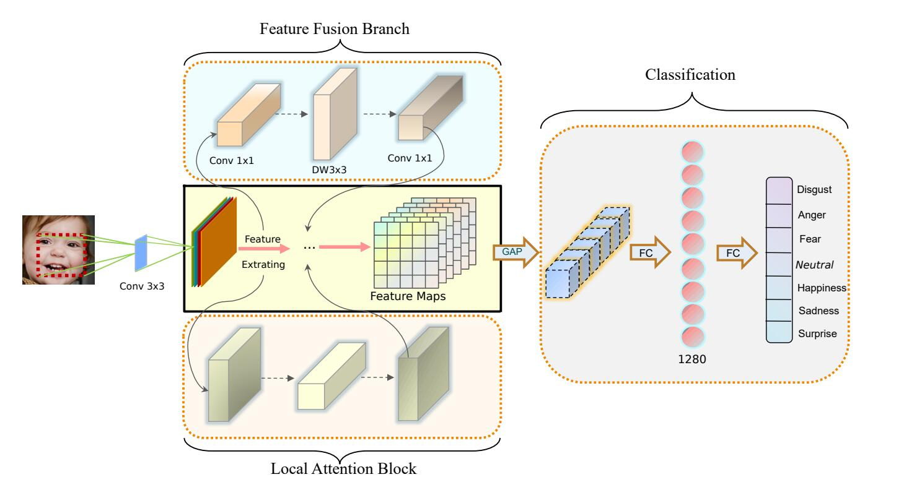
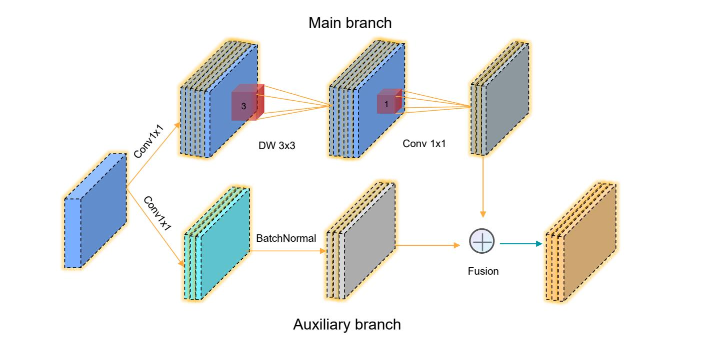
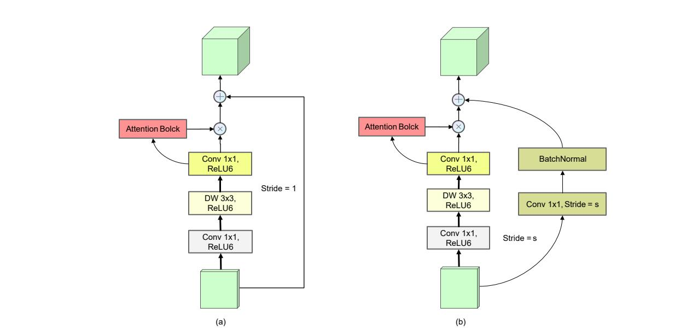

# EMO-Net

## **Lightweight Network with Feature Fusion Branchand Local Attention Block for Facial Expression Recognition**



A PyTorch implementation of the [EMO-Net](), pre-trained models are available in checkpoint.

___

### **Local Attention Block -- Efficient Channel Attention**


​			 The architecture of the ECA mechanism used in the inverted residual structure, where GAP denotes global average pooling and σ denotes the Sigmoid function.

___

### **Feature Fusion Branch**



​				Feature fusion branch is utilized in the inverted residual structure. Main branch is the feature extractor which combines with auxiliary branch with shallow geometry feature. DW 3x3 denotes a depth-separable convolution, and ⊕ denotes a summary of two branchs.

****



​					The architecture of the two fusion branches in the inverted residual structure, including the main branch (feature extractor and local attention module) and the auxiliary branch

### **Requirements**

- Python >= 3.6
- PyTorch >= 1.2
- torchvision >= 0.4.0

### **Training**

- Step 1: download basic emotions dataset of [RAF-DB](http://www.whdeng.cn/raf/model1.html), and make sure it have the structure like following:

  ```
  ./RAF-DB/
           train/
                 0/
                   train_09748.jpg
                   ...
                   train_12271.jpg
                 1/
                 ...
                 6/
           test/
                0/
                ...
                6/
  [Note] 0: surprise; 1: fear; 2: disgust; 3: happy; 4: sad; 5: anger; 6: neutral
  ```

- Step 2: load the model weight in the **./checkpoint**
- Step 3: change ***data_path*** in **train.py** to your path
- Step 4: run `python train.py `

### **Model Weight**

|   Dataset   | accuracy (%) |  λ   |          weigth.pth          |
| :---------: | :----------: | :--: | :--------------------------: |
|    RAFDB    |    91.30     | 0.5  |    RAFDB_a_0.5_0.913.pth     |
|    RAFDB    |    91.52     | 0.6  |    rafdb_a_0.6_0.915.pth     |
| AffectNet-7 |    65.456    | 0.6  | affectNet7_a_0.6_0.65457.pth |
| AffectNet-8 |    62.08     | 0.6  | affectNet8_a_0.6_0.6208.pth  |

### **Experiments**

​								 **Comparison with state-of-the-art methods on RAF-DB**

|                            Method                            | Parms. (M) | FLOPs. (G) |        Acc.(%)        |
| :----------------------------------------------------------: | :--------: | :--------: | :-------------------: |
|                          [gACNN]()                           |   134.3    |   15.47    |         85.07         |
| [RAN](https://github.com/kaiwang960112/Challenge-condition-FER-dataset) |   11.19    |   14.59    |         86.90         |
|       [MA-Net](https://github.com/zengqunzhao/MA-Net)        |   63.54    |    3.66    |         88.40         |
|  [SCN](https://github.com/kaiwang960112/Self-Cure-Network)   |   11.18    |    1.82    |         87.03         |
| [EfficientFace](https://github.com/zengqunzhao/EfficientFace) |    1.28    |    0.18    |         88.36         |
|          [MViT](https://github.com/muse1998/mmnet)           |    4.94    |    1.46    |         88.62         |
|             [DAN](https://github.com/yaoing/DAN)             |   19.72    |    2.24    |         89.70         |
| [EAC](https://github.com/zyh-uaiaaaa/Erasing-Attention-Consistency) |   25.55    |    4.13    |         90.35         |
|                         [EMO-Net]()                          |    2.31    |    0.34    | [91.30](./checkpoint) |

​										**Comparison with state-of-the-art methods on AffectNet-7**

|                            Method                            |      Backbone      |          Acc.(%)          |
| :----------------------------------------------------------: | :----------------: | :-----------------------: |
|                          [gACNN]()                           |       VGG-16       |           59.78           |
|                         [VGG-FACE]()                         |       VGG-16       |           60.00           |
|       [MA-Net](https://github.com/zengqunzhao/MA-Net)        |     ResNet-18      |           64.53           |
| [EfficientFace](https://github.com/zengqunzhao/EfficientFace) |   ShuffleNet-V2    |           63.70           |
|          [MViT](https://github.com/muse1998/mmnet)           | Vision Transformer |           64.57           |
| [EfficientNet-B0](https://github.com/tensorflow/tpu/tree/master/models/official/efficientnet) |    EfficientNet    |           64.32           |
|                         [EMO-Net]()                          |    MobileNet-V2    | **[65.46](./checkpoint)** |

​								**Comparison with state-of-the-art methods on AffectNet-8**

|                            Method                            |      Backbone      |          Acc.(%)          |
| :----------------------------------------------------------: | :----------------: | :-----------------------: |
|                           [RAN]()                            |     ResNet-18      |           59.50           |
|       [MA-Net](https://github.com/zengqunzhao/MA-Net)        |     ResNet-18      |           60.29           |
| [EfficientFace](https://github.com/zengqunzhao/EfficientFace) |   ShuffleNet-V2    |           59.89           |
|          [MViT](https://github.com/muse1998/mmnet)           | Vision Transformer |           61.40           |
| [EfficientNet-B0](https://github.com/tensorflow/tpu/tree/master/models/official/efficientnet) |    EfficientNet    |           61.32           |
|                         [EMO-Net]()                          |    MobileNet-V2    | **[62.08](./checkpoint)** |

